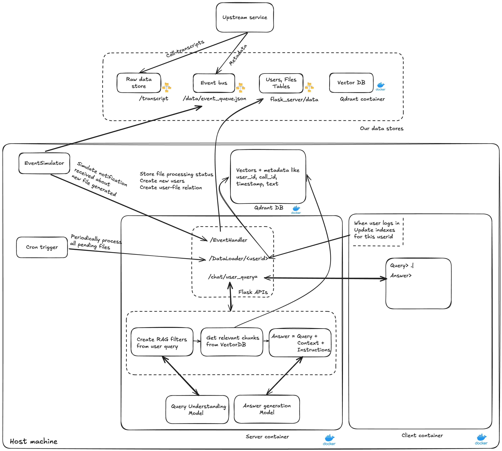

# Sales Agent Chatbot

## Assumptions -

1. User should only be allowed to query those call transcripts they were part of.
2. Each transcript call file we are getting is uniquely named. 
3. Along with the files we are also getting metadata in the form of JSON events which contains - a) Filename b) Names of all participants (As present in the transcript call) c) Timestamp of the meeting
4. Frequency of periodic processing of files to create indexes is calibrated by observing user login latency as we are processing any delta files for that user when they log in.

## Architecture Diagram

## Storage design -

1. Vector DB(Qdrant): Persistent volume attached to qdrant container
2. Relational DB (Simulated using CSV files: Persistent volume attached to flask_server container
   1. Files Table - file_id,filename,status,timestamp
   2. Users Table - user_id,user_name 
   3. File participants Table(Maps relation between users and files) - file_id,user_id
3. Event queue(Simulated using JSON file): Persistent volume attached to flask_server container
4. Transcript files raw data (Data storage simulated using filesystem folder)

## How to Run Instructions -

1. Install docker on laptop using Docker Desktop or Colima
2. Setting up server and VectorDB containers -
    1. Run `docker-compose --build qdrant flask_server` to build containers
    2. Run `docker-compose up -d qdrant flask_server` to start containers
3. Setting up client container -
    1. Run `docker-compose --build client` to build container
    2. Run `docker-compose rm client python client.py` to start client CLI chatbot

## Current Project state:
1. Converting files to embeddings is working properly using token embedding model.
2. Model loading taking longer time than usual. Docker/Colima setup needs to be improved.
3. Wanted to use ready-made Mixtral-7B model with 4-bit quantization aiming latency <5s and 16k token support.
   But since model loading was taking time I experimented with FlanT5 which is not good enough for the task.
   Unfortunately need to upload this version as I am running out of time.

